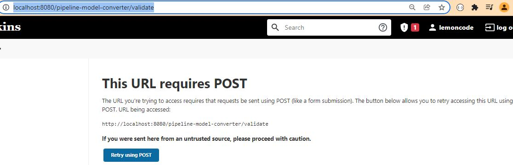
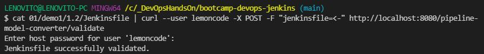

Introduction

This repository is the result of running the exercises detailed in [01-jenkins](https://github.com/Lemoncode/bootcamp-devops-lemoncode/tree/master/03-cd/01-jenkins).

Running Jenkins in Docker
For all the exercises I am running a Jenkins instance as a Docker container and persisting my Jenkins server state using Docker Volumes. I use the dockerized version: https://hub.docker.com/r/jenkins/jenkins/

My local machine is a host for Jenkins container. When Jenkins needs to run tasks, it builds a docker container and runs specific commands on it. This is why is called Docker in Docker. More info here https://www.jenkins.io/doc/book/installing/docker/

Exercises's Order
 
1. Pre-req
2. demo0
3. demo1
4. 01

How to validate a Jenkinsfile?

```
cat 01/demo1/1.2/Jenkinsfile | curl --user lemoncode -X POST -F "jenkinsfile=<-" http://localhost:8080/pipeline-model-converter/validate
```




