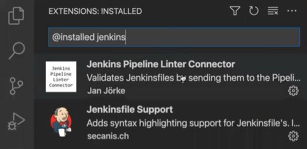

Introduction

This repository is the result of running the exercises detailed in [01-jenkins](https://github.com/Lemoncode/bootcamp-devops-lemoncode/tree/master/03-cd/01-jenkins).

Running Jenkins in Docker
For all the exercises I am running a Jenkins instance as a Docker container and persisting my Jenkins server state using Docker Volumes. I use the dockerized version: https://hub.docker.com/r/jenkins/jenkins/

My local machine is a host for Jenkins container. When Jenkins needs to run tasks, it builds a docker container and runs specific commands on it. This is why is called Docker in Docker. More info here https://www.jenkins.io/doc/book/installing/docker/ and https://www.jenkins.io/doc/tutorials/create-a-pipeline-in-blue-ocean/

Exercises's Order
 
1. Pre-req
2. demo0. Passing variable from jenkins to shell script 
3. demo1
    * 1.1 Jenkins Pipeline Environment Variables
    * 1.2 Jenkins Parameterized Builds 
    * 1.3 Parallel stages with Declarative Pipeline
4. 01
    * demo1
        * 1.1 Getting Project Version from Node / package.json in Jenkins
        * 1.2 When Conditional step/stage in Jenkins pipeline
	* 1.3 Refactoring by creating functions to be reused
    * solution

How to validate a Jenkinsfile?

```
cat 01/demo1/1.2/Jenkinsfile | curl --user lemoncode -X POST -F "jenkinsfile=<-" http://localhost:8080/pipeline-model-converter/validate
```
```
Enter host password for user 'lemoncode':
Jenkinsfile successfully validated.
```


