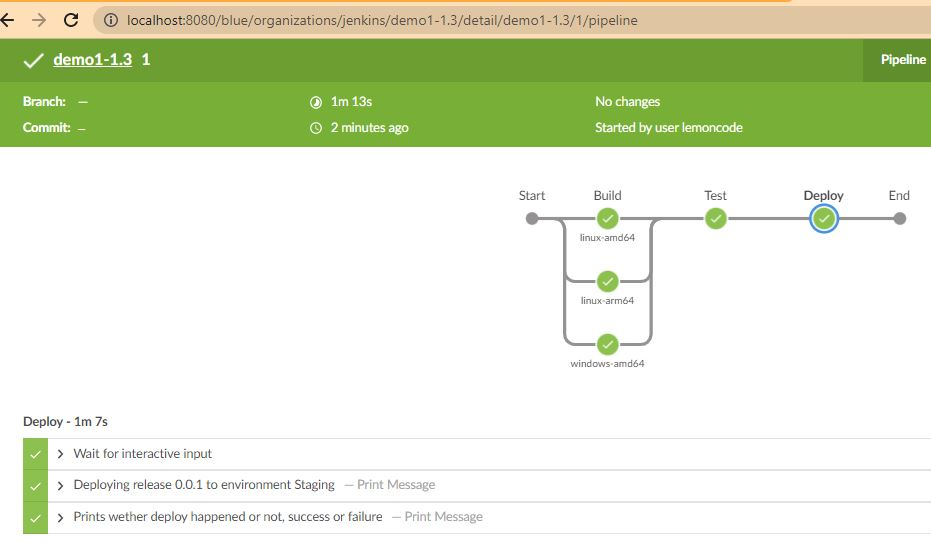

# Parallel stages

Browse the Open Blue Ocean UI http://localhost:8080

1. New item, pipeline, copy item, demo1-1.3 from demo1-2.
2. Path to Jenkinsfile demo1/1.3/Jenkinsfile 
3. Build Now 
4. Check. Open console from running build
5. Parallel stages complete in any order




6. Then pause on input and then post. https://www.jenkins.io/doc/book/pipeline/syntax/#post

```
...
[Pipeline] // stage
[Pipeline] stage
[Pipeline] { (Deploy)
[Pipeline] input
Input requested
Approved by lemoncode
[Pipeline] withEnv
[Pipeline] {
[Pipeline] echo
Deploying release 0.0.1 to environment Staging
[Pipeline] }
[Pipeline] // withEnv
[Pipeline] }
[Pipeline] // stage
[Pipeline] stage
[Pipeline] { (Declarative: Post Actions)
[Pipeline] echo
Prints whether deploy happened or not, success or failure
[Pipeline] }
[Pipeline] // stage
[Pipeline] }
[Pipeline] // withEnv
[Pipeline] }
[Pipeline] // withEnv
[Pipeline] }
[Pipeline] // node
[Pipeline] End of Pipeline
Finished: SUCCESS
```

